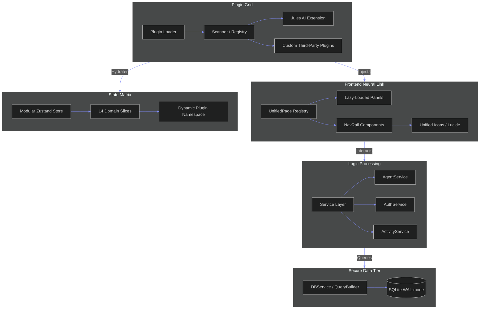

# Mission Control: The Modular Architecture

Welcome to the **System Core**. Our architecture has been upgraded to a high-fidelity, modular grid designed for massive agent orchestration.

## System Overview

## Architectural Pillars

### 1. The Dynamic Plugin Engine (Discord-Style)
Our system uses a discovery-based plugin architecture. Plugins are not "hard-linked"; they are **discovered** and **injected**.
- **Metadata-First**: Each plugin provides its identity, version, and required permissions.
- **Lifecycle Hooks**: `onServerInit` and `onClientInit` allow plugins to boot their own logic.
- **Dynamic Registration**: Panels, navigation, and state are registered on-the-fly, preventing core code bloat.

### 2. Modular State Matrix
We've killed the "God Store". The state is now a collection of **Slices**.
- **Isolation**: Changes in the `ChatSlice` don't trigger re-renders in the `AgentSlice`.
- **Extensibility**: Plugins can register their own private state slices within the global matrix.

### 3. Clean Architecture Services
Business logic is decoupled from the HTTP transport layer.
- **Pure Services**: `AgentService` handles the complex orchestration logic without knowing about Next.js request objects.
- **Query Abstraction**: The `DBService` provides a fluent QueryBuilder interface, shielding logic from raw SQL and making the system database-agnostic.

### 4. Lazy-Loaded Neural Link
The UI is optimized for speed and modularity.
- **Suspense-Driven**: Plugin panels are loaded only when accessed.
- **Unified Registry**: The main router is a simple lookup against the `pluginRegistry`, making it virtually indestructible during updates.

---

> *"The code is a grid. Information flows in pulses. Modularity is the only path to survival."*
